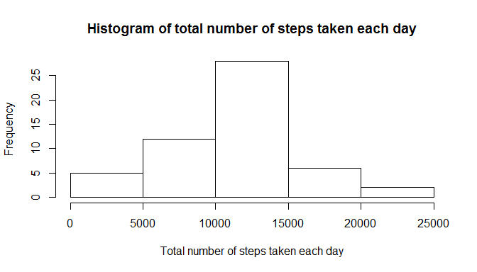
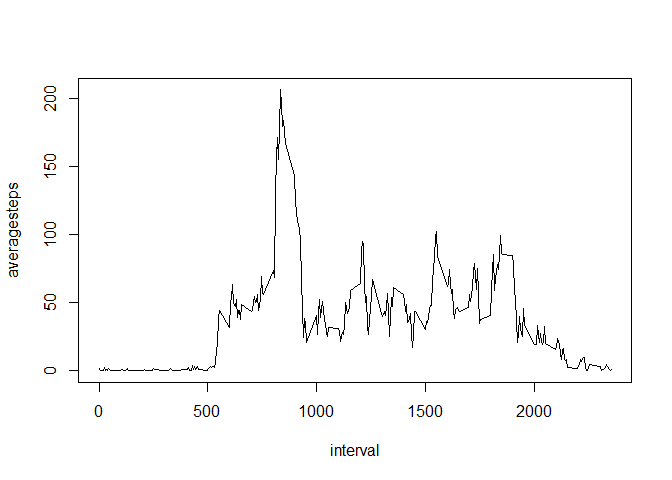

# Reproducible Research: Peer Assessment 1


## Loading and preprocessing the data


```r
rawdata <- read.table(unz("activity.zip", "activity.csv"), header = TRUE, sep = ",")
```

date columns have to be converted to data.

```r
cleandata <- rawdata
cleandata$date <- as.Date(cleandata$date)
```

## What is mean total number of steps taken per day?
Before conducting analysis, I load the dplyr package. 

```r
library(dplyr)
```

```
## Warning: package 'dplyr' was built under R version 3.1.3
```

```
## 
## Attaching package: 'dplyr'
## 
## The following objects are masked from 'package:stats':
## 
##     filter, lag
## 
## The following objects are masked from 'package:base':
## 
##     intersect, setdiff, setequal, union
```

In order to calculate the mean total number of daily steps, I created a dataset that consists of date and daily total steps.

```r
by_date <- group_by(cleandata, date)
by_date_steps <- summarize(by_date, sum(steps))
by_date_steps <- rename(by_date_steps, totalsteps = `sum(steps)`)
```


```r
hist(by_date_steps$totalsteps, main = paste("Histogram of total number of steps taken each day"), xlab = "Total number of steps taken each day")
```

 


```r
mean_dailysteps <- mean(by_date_steps$totalsteps, na.rm = TRUE)
mean_dailysteps
```

```
## [1] 10766.19
```

```r
median_dailysteps <- median(by_date_steps$totalsteps, na.rm = TRUE)
median_dailysteps
```

```
## [1] 10765
```

The mean of the total number of steps taken per day is 1.0766189\times 10^{4} and the median is 10765.

## What is the average daily activity pattern?


```r
by_interval <- group_by(cleandata, interval)
by_interval_steps <- summarize(by_interval, mean(steps, na.rm = TRUE))
by_interval_steps <- rename(by_interval_steps, averagesteps = `mean(steps, na.rm = TRUE)`)
plot(by_interval_steps, type = "l")
```

 


```r
max_steps_interval <- filter(by_interval_steps, averagesteps == max(averagesteps))
max_steps_interval
```

```
## Source: local data frame [1 x 2]
## 
##   interval averagesteps
## 1      835     206.1698
```

The 5-minute interval of 835 contains the maximum number of steps.

## Imputing missing values
The total number of the missing values in the dataset is calculated as below.

```r
sum(is.na(cleandata$steps))
```

```
## [1] 2304
```

Taking into consideration that the dataset contains a large number of observations, I decided to use the mean (instead of median) for the interval to fill the missing values in the dataset.


```r
nadata <- cleandata[is.na(cleandata),]
```

I was not able to figure out how to fill NA with the mean values...

## Are there differences in activity patterns between weekdays and weekends?


